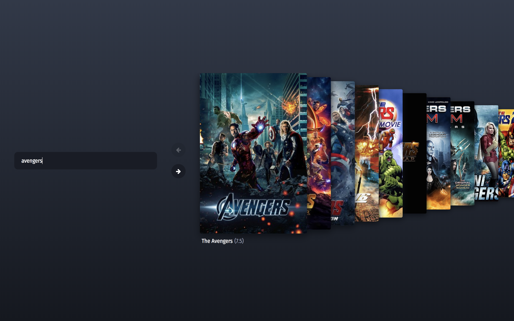

# MovieDB search

This project provides a simple UI for searching the MovieDB by movie title.

## Quickstart

1. Ensure docker and docker-compose are both installed
2. Run `docker-compose up -d` from the project root
3. Visit http://localhost:8080

## Architecture

This project comprises three services to provide the search feature: a search UI (services/search), a caching API proxy (services/api-proxy) and a caching image proxy (services/image-proxy).

### Search UI

This is a React and Rx powered UI - written in TypeScript - providing a simple search input and coverflow-inspired results view.

#### Implementation notes

* Atomic and molecular components were developed inside Storybook (`yarn storybook`).
* The search input includes a few optimisations, such as minimum query length and debouncing, to prevent hammering the upstream API on each keypress.
* The coverflow "Showcase" component uses CSS transforms to ensure good performance of transitions.
* A mixture of snapshot tests, BDD-style functional tests and TDD-style unit tests are used where appropriate.

### API and image proxies

These services are highly simplified, representative of the sorts of backend service typically required in a content-delivery, microservice architectures.

More meaningful variations of these services could - for example - implement a time-aware, byte-size limited LRU cache for more realistic, timely cache invalidation. Further, the image cache could also perform some kind of optimisation to reduce bytes over the network.

## Possible improvements

* Implement non-happy paths: loading, empty and failure states
* Write e2e tests for movie search screen
* Enable production optimisations (e.g. UglifyJS in webpack config)
* Finesse animations, e.g. with react-motion
* Enable hot module replacement
* Provide reverse proxy to support scaling services
* Support micro-frontend architecture

## Feedback and closing thoughts

This was an enjoyable task, though I comfortably exceeded the recommended 3-4 hours.

While I believe that the task can be completed in that timeframe, I am less convinced that a meaningful and fully representative solution can be built in that time.

Admittedly, I introduced layers of complexity by adding multiple, containerised services, and using a heavyweight toolchain of TypeScript, webpack and Storybook, but it was important for me to give an accurate demonstration of how I think about application architecture and UI development.
